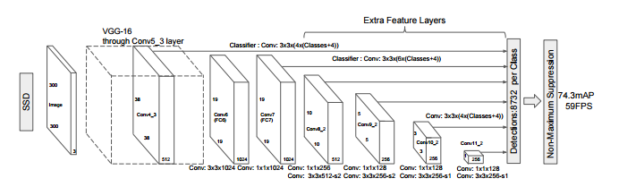

# Object-Detection-SSD
<hr>

## Intro

Detecting Multiple objects in a video using Single Shot Multibox Detector

Weight Files are splitted as
<ul>
    <li>ssd300_mAP_77.43_v2.pth.000</li>
    <li>ssd300_mAP_77.43_v2.pth.001</li>
    <li>ssd300_mAP_77.43_v2.pth.002</li>
    <li>ssd300_mAP_77.43_v2.pth.003</li>
    <li>ssd300_mAP_77.43_v2.pth.004</li>
</ul>

Join weight files [Here](http://pinetools.com/join-files)

Read more about <b>SSD</b> [here](hhttps://arxiv.org/pdf/1512.02325.pdf)


Click on this image to see demo from SSD:

[](http://i.imgur.com/EyZZKAA.gif)

## Dependencies

Check out the <b>virtual_platform_windows.yml</b> file

### Getting started

Create a virtual platform.
    ```
    conda env create -f virtual_platform_windows.yml
    ```

## Working
[]

## Testing

**updateobject_detection.py**
</br>reader = imageio.get_reader('`video`.mp4')


##  Getting data set for Training a new model

Training is simple but GPU `CUDA` is mandatory otherwise it will take months to train on a CPU:

```bash
#Get the dataset:
(http://host.robots.ox.ac.uk/pascal/VOC/index.html)
```

<b>Created by:</b><br><i><b>Anubhav Shukla</b></i>
